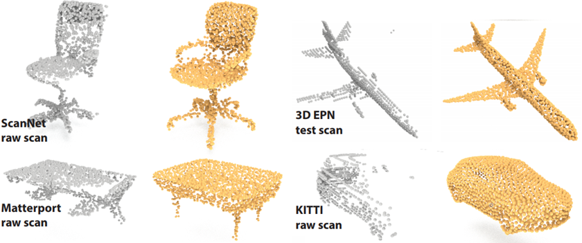

### Unpaired Point Cloud Completion on Real Scans using Adversarial Training

Implementation of arxiv preprint paper <a href="https://128.84.21.199/abs/1904.00069" target="_blank">(link)</a>.

### Dependencies
The code is tested with Python 3.5, TensorFlow 1.5, CUDA 9.0 on Ubuntu. 

### Installation
#### Compile Customized TF Operators from PointNet2
Instructions can be found from <a href="https://github.com/charlesq34/pointnet2" target="_blank">PointNet2</a>.
#### Compile the EMD/Chamfer losses (CUDA implementations from <a href="https://github.com/charlesq34/pointnet2" target="_blank">Fan et al.</a>)
    cd pcl2pcl-gan-pub/pc2pc/structural_losses_utils
    # with your editor, modify the paths in the makefile
    make

### Data
For convenience, we provide our synthetic clean and complete point clouds, and point representation data of 3D-EPN, download <a href="http://irc.cs.sdu.edu.cn/~xuelin/pcl2pcl/data.zip" target="_blank">data</a>.
After download is finished, unzip the zip file, put it under pcl2pcl-gan-pub/pc2pc/data

### Train
For training for a specific class (before that, cd pcl2pcl-gan-pub/pc2pc):
1. train AE for clean and complete point clouds:
    CUDA_VISIBLE_DEVICES=0 python3 train_ae_ShapeNet-v1.py

2. train AE for incomplete point clouds from 3D-EPN data:
    CUDA_VISIBLE_DEVICES=0 python3 train_ae_3D-EPN.py

3. train GAN:
    CUDA_VISIBLE_DEVICES=0 python3 train_pcl2pcl_gan_3D-EPN.py
